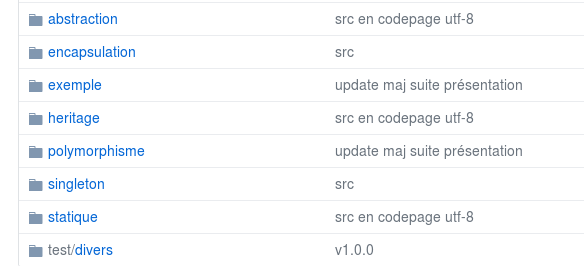

# Page personnelle de Nicolas Hovart

## Réalisations

* [Projet Lonepod](https://NicolasHov.github.io/lonepod/#svg) réalisé dans le cadre du Hackacon Paris, les 10&11 juin 2017 au Tank

* [Rétro-engineering Home Page de Google en utilisant Bootstrap&jQuery](https://github.com/NicolasHov/home_page_google)

* [Scrapping d'adresses mails et envois automatiques de mails via gmail](https://github.com/NicolasHov/THPsemaine2/tree/master/Scrapping)
 
<!--* (Projet de création d'une application Web Java avec Spring Boot et Hibernate (techno front à déterminer)...) -->
<!--* (Création d'une interface ReactJS pour l'application Web Java -->
<!--Selon progression :-->
<!--* Création d'une page web de ressources HTML/CSS en ReactJS-->

## Contenus pédagogiques Java (liste non exhaustive par souci de confidentialité)

### Enoncés d'exercices

* [Java_Challenge_resalogement (forké depuis le github Simplon.co)](https://github.com/NicolasHov/Java_Challenge_resalogement)

### Supports théoriques

* [Notions de bases, fondamentaux de la POO](https://github.com/simplonco/java-initiation)
*  
